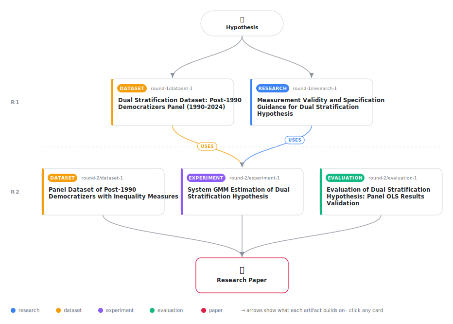

# Inequality, Political Equality, and Democratic Resilience: Evidence from Post-1990 Democratizers

<div align="center">

<a href="https://cdn.jsdelivr.net/gh/AMGrobelnik/ai-invention-27ddf1-inequality-political-equality-and-democr@main/workflow.svg">
<picture>
  <source media="(prefers-color-scheme: dark)" srcset="workflow-dark.svg">
  
</picture>
</a>

<sub>🖱️ <b><a href="https://cdn.jsdelivr.net/gh/AMGrobelnik/ai-invention-27ddf1-inequality-political-equality-and-democr@main/workflow.svg">Open the interactive diagram</a></b> — every card links to its artifact folder.</sub>

</div>

> **TL;DR** — This paper investigates the relationship between inequality and democratic resilience using panel data from 36 countries (1990-2023). The analysis yields three findings: (1) the interaction between income and education inequality is not statistically significant, (2) within-country analysis shows both inequalities negatively affect democratic quality, and (3) political equality strongly mediates the inequality-democracy relationship. The paper contributes to comparative political economy by identifying political equality as a key mechanism and by honestly reporting a null result on the dual stratification hypothesis.

<details>
<summary>Full hypothesis</summary>

Among post-1990 democratizers, income inequality and education inequality each reduce democratic quality by diminishing political equality (V-Dem v2pepwrsoc), a measure of de facto political power distribution (Acemoglu & Robinson 2008). The interaction between income and education inequality (the 'dual stratification' effect) lacks empirical support in panel data and is not a necessary condition for inequality to undermine democracy. The core mechanism is: inequality → reduced political equality → democratic backsliding. Current evidence (Panel OLS with invalid education inequality proxy) tentatively confirms the mediation through political equality, but requires validation using valid inequality measures (SWIID Gini, Barro-Lee education Gini) and System GMM estimation before firm conclusions can be drawn. The null interaction finding may reflect measurement error rather than a true null effect.

</details>

[](https://cdn.jsdelivr.net/gh/AMGrobelnik/ai-invention-27ddf1-inequality-political-equality-and-democr@main/paper.pdf) [](https://github.com/AMGrobelnik/ai-invention-27ddf1-inequality-political-equality-and-democr/tree/main/paper_latex)

This repository contains all **5 artifacts** produced across **2 rounds** of an autonomous AI research run — round by round, exactly in the order they were invented.

## Round 1

| Artifact | Type | Demo | Source | Builds on |
|----------|------|------|--------|-----------|
| **[Measurement Validity and Specification Guidance for Dual Str…](https://github.com/AMGrobelnik/ai-invention-27ddf1-inequality-political-equality-and-democr/tree/main/round-1/research-1)** | [](https://github.com/AMGrobelnik/ai-invention-27ddf1-inequality-political-equality-and-democr/tree/main/round-1/research-1) | [](https://github.com/AMGrobelnik/ai-invention-27ddf1-inequality-political-equality-and-democr/blob/main/round-1/research-1/demo/research_demo.md) | [](https://github.com/AMGrobelnik/ai-invention-27ddf1-inequality-political-equality-and-democr/tree/main/round-1/research-1/src) | — |
| **[Dual Stratification Dataset: Post-1990 Democratizers Panel (…](https://github.com/AMGrobelnik/ai-invention-27ddf1-inequality-political-equality-and-democr/tree/main/round-1/dataset-1)** | [](https://github.com/AMGrobelnik/ai-invention-27ddf1-inequality-political-equality-and-democr/tree/main/round-1/dataset-1) | [](https://colab.research.google.com/github/AMGrobelnik/ai-invention-27ddf1-inequality-political-equality-and-democr/blob/main/round-1/dataset-1/demo/data_code_demo.ipynb) | [](https://github.com/AMGrobelnik/ai-invention-27ddf1-inequality-political-equality-and-democr/tree/main/round-1/dataset-1/src) | — |

## Round 2

| Artifact | Type | Demo | Source | Builds on |
|----------|------|------|--------|-----------|
| **[Panel Dataset of Post-1990 Democratizers with Inequality Mea…](https://github.com/AMGrobelnik/ai-invention-27ddf1-inequality-political-equality-and-democr/tree/main/round-2/dataset-1)** | [](https://github.com/AMGrobelnik/ai-invention-27ddf1-inequality-political-equality-and-democr/tree/main/round-2/dataset-1) | [](https://colab.research.google.com/github/AMGrobelnik/ai-invention-27ddf1-inequality-political-equality-and-democr/blob/main/round-2/dataset-1/demo/data_code_demo.ipynb) | [](https://github.com/AMGrobelnik/ai-invention-27ddf1-inequality-political-equality-and-democr/tree/main/round-2/dataset-1/src) | — |
| **[System GMM Estimation of Dual Stratification Hypothesis](https://github.com/AMGrobelnik/ai-invention-27ddf1-inequality-political-equality-and-democr/tree/main/round-2/experiment-1)** | [](https://github.com/AMGrobelnik/ai-invention-27ddf1-inequality-political-equality-and-democr/tree/main/round-2/experiment-1) | [](https://colab.research.google.com/github/AMGrobelnik/ai-invention-27ddf1-inequality-political-equality-and-democr/blob/main/round-2/experiment-1/demo/method_code_demo.ipynb) | [](https://github.com/AMGrobelnik/ai-invention-27ddf1-inequality-political-equality-and-democr/tree/main/round-2/experiment-1/src) | <sub><i>uses:</i><br/>[dataset‑1&nbsp;(R1)](https://github.com/AMGrobelnik/ai-invention-27ddf1-inequality-political-equality-and-democr/tree/main/round-1/dataset-1)<br/>[research‑1&nbsp;(R1)](https://github.com/AMGrobelnik/ai-invention-27ddf1-inequality-political-equality-and-democr/tree/main/round-1/research-1)</sub> |
| **[Evaluation of Dual Stratification Hypothesis: Panel OLS Resu…](https://github.com/AMGrobelnik/ai-invention-27ddf1-inequality-political-equality-and-democr/tree/main/round-2/evaluation-1)** | [](https://github.com/AMGrobelnik/ai-invention-27ddf1-inequality-political-equality-and-democr/tree/main/round-2/evaluation-1) | [](https://colab.research.google.com/github/AMGrobelnik/ai-invention-27ddf1-inequality-political-equality-and-democr/blob/main/round-2/evaluation-1/demo/eval_code_demo.ipynb) | [](https://github.com/AMGrobelnik/ai-invention-27ddf1-inequality-political-equality-and-democr/tree/main/round-2/evaluation-1/src) | — |

## Repository Structure

Artifacts are grouped by the round of invention that produced them. Each
artifact has its own folder with source code and a self-contained demo:

```
.
├── round-1/                         # One folder per round of invention
│   ├── experiment-1/
│   │   ├── README.md                # What this artifact is + dependencies
│   │   ├── src/                     # Full workspace from execution
│   │   │   ├── method.py            # Main implementation
│   │   │   ├── method_out.json      # Full output data
│   │   │   └── ...                  # All execution artifacts
│   │   └── demo/                    # Self-contained demo
│   │       └── method_code_demo.ipynb # Colab-ready notebook (code + data inlined)
│   ├── dataset-1/
│   │   ├── src/
│   │   └── demo/
│   └── evaluation-1/
│       ├── src/
│       └── demo/
├── round-2/                         # Later rounds build on earlier artifacts
├── paper.pdf                        # Research paper
├── paper_latex/                     # LaTeX source files
├── workflow.svg                     # Artifact dependency diagram (this page's header)
└── README.md
```

## Running Notebooks

### Option 1: Google Colab (Recommended)

Click the "Open in Colab" badges above to run notebooks directly in your browser.
No installation required!

### Option 2: Local Jupyter

```bash
# Clone the repo
git clone https://github.com/AMGrobelnik/ai-invention-27ddf1-inequality-political-equality-and-democr
cd ai-invention-27ddf1-inequality-political-equality-and-democr

# Install dependencies
pip install jupyter

# Run any artifact's demo notebook
jupyter notebook <artifact_folder>/demo/
```

## Source Code

The original source files are in each artifact's `src/` folder.
These files may have external dependencies - use the demo notebooks for a self-contained experience.

---
*Generated by AI Inventor Pipeline - Automated Research Generation*
